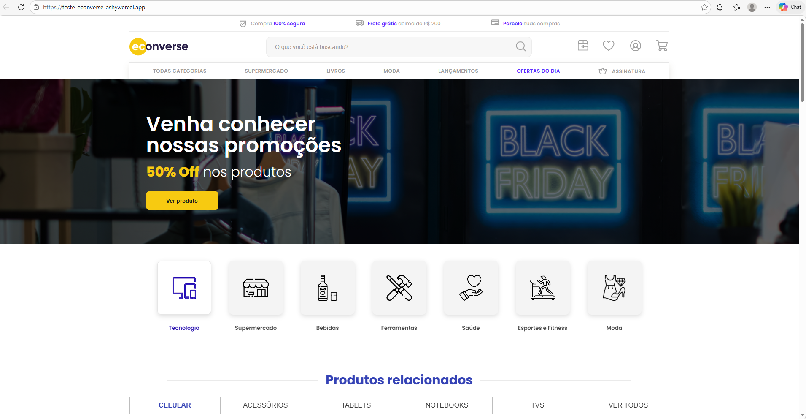

[TYPESCRIPT__BADGE]: https://img.shields.io/badge/typescript-D4FAFF?style=for-the-badge&logo=typescript
[REACT__BADGE]: https://img.shields.io/badge/React-005CFE?style=for-the-badge&logo=react

<h1 align="center" style="font-weight: bold;">Teste Econverse 💻</h1>

![react][REACT__BADGE]
![typescript][TYPESCRIPT__BADGE]

<details open="open">
<summary>Table of Contents</summary>
 
- [Tech](#tech)
- [About](#about)
- [Architecture](#architecture)
- [Getting started](#getting-started)
- [Prerequisites](#requisites)
- [Cloning](#cloning)
- [Starting](#starting)
- [Deploy](#deploy)
  
</details>

<p align="center">
    
</p>

<h2 id="tech">💻 Tech</h2>

- React 19
- TypeScript
- Vite
- Sass (SCSS Modules)
- Fetch API
- Deploy na Vercel

<h2 id="architecture">💯 Architecture</h2>

The project follows a component-based structure with separation of concerns (components, hooks, helpers and types).

<h2 id="about">📌 About</h2>

E-commerce page developed using **React + TypeScript**, following the Figma layout provided for the technical challenge.

The project consumes an external JSON API to render the product showcase and implements a modal interaction displaying detailed product information. The layout was built pixel-perfect and is fully responsive.

Semantic HTML structure and basic SEO best practices were applied.

<h2 id="getting-started">🚀 Getting started</h2>

To run this project locally, make sure you have the required tools installed and follow the steps below.

<h3 id="requisites">Prerequisites</h3>

- [NodeJS]
- [Git]

<h3 id="cloning">Cloning</h3>

```bash
git clone https://github.com/Verninii/teste-econverse.git
```

<h3 id="starting">Starting</h3>

```bash
cd teste-econverse
npm install
npm run dev
```

<h3 id="deploy">🔗 Deploy</h3>
https://teste-econverse-ashy.vercel.app/
